# The Inertia Protocol (v3)

A specification for implementing the **server side** of Inertia in any language
or framework. The counterparty is the official Inertia client
(`@inertiajs/core` v3 and its framework adapters); this document describes what
your server must send and accept so that client works unmodified.

Terminology:

- **Server** - the adapter you are implementing.
- **Client** - the official Inertia JavaScript runtime in the browser.
- **MUST / SHOULD / MAY** - requirement levels (RFC 2119 sense).

---

## 1. Model

Inertia builds a single-page app **without a separate API**. The server keeps
owning routing, controllers, auth, and data access; the client owns rendering.
The only thing exchanged is one JSON document - the **page object** - describing
which component to render and with what props.

A single endpoint serves two response shapes, chosen per request:

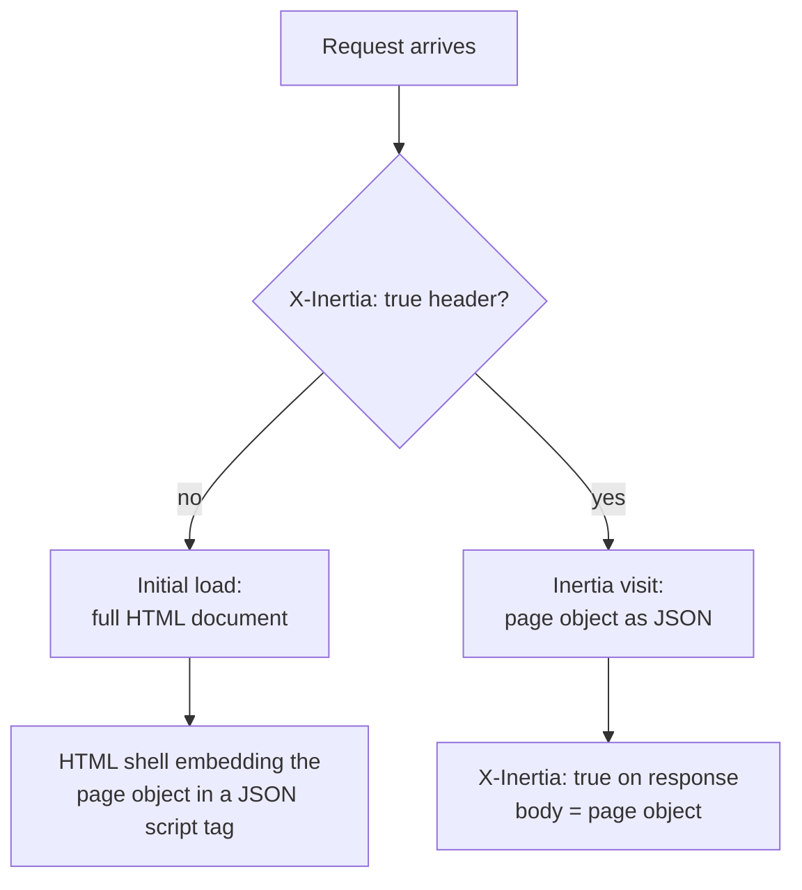
<!-- fig: 01-request-dispatch | Request dispatch -->

- **Initial load** - a normal browser navigation with no `X-Inertia` header. The
  server returns a complete HTML document with the page object embedded in it.
  The client boots from that and takes over.
- **Inertia visit** - a link click or form submit the client intercepts. The
  client sends `X-Inertia: true`; the server returns the **same page object** as
  JSON. The client swaps the component and props in place, with no full reload.

The page object is identical in both modes; the HTML shell is only a transport
for the first one.

---

## 2. Glossary

The protocol's vocabulary. Skim this once; the rest of the document assumes it.

| Term | Meaning |
| --- | --- |
| **Page object** | The single JSON document the server returns on every render (section 3). |
| **Props** | The data bag passed to the page component, under the page object's `props`. |
| **Prop path** | A dot-notation key into `props`: a top-level key (`users`) or nested (`auth.user`, `feed.data`). The client resolves it by splitting on `.`. |
| **Full visit** | An Inertia request with no partial headers; the server resolves all eager props (section 6). Also called a *standard visit*. |
| **Partial reload** | An Inertia request scoped to a component, requesting a subset of props (section 9). |

### Prop categories

How a prop is evaluated on a given render. These are protocol concepts; how a
server exposes them in its API is an implementation choice.

| Category | One-line meaning |
| --- | --- |
| **eager** | A plain value; resolved and sent on every response. |
| **always** | Sent on every response; immune to partial-reload cherry-picking. |
| **optional** | Lazy; sent only when a partial reload explicitly requests it. Not announced. |
| **deferred** | Lazy; skipped on the full visit but *announced* so the client auto-fetches it after load. |
| **merge / deepMerge / prepend** | Sent, but labelled so the client combines it with the value it already holds instead of replacing. |
| **once** | Sent once, then cached by the client across visits and skipped while the client holds it. |
| **scroll** | A paginated value the client keeps extending (infinite scroll); a merge prop plus a pagination cursor. |

### Manifest fields and when the server emits them

The page object carries several metadata maps/arrays. **Which mode a field
appears in is part of the contract:**

| Field | Full visit | Partial reload |
| --- | --- | --- |
| `deferredProps` | **populated** - the fetch manifest | **always empty** (`{}`) |
| `rescuedProps` | **always empty** (`[]`) | **populated** when a deferred prop's resolution failed |
| `mergeProps` / `deepMergeProps` / `prependProps` / `matchPropsOn` | for mergeable props in this response | for mergeable props in this response |
| `scrollProps` | for resolved scroll props (a *deferred* scroll prop emits none) | for resolved scroll props |
| `onceProps` | for once props encountered | for once props encountered |

The split has a reason:

- `deferredProps` is a **fetch manifest** - only the full visit announces "fetch
  these later". A partial reload *is* the act of fetching, so it carries no
  manifest (re-announcing would risk a refetch loop).
- `rescuedProps` is the inverse: deferred props only **resolve** on a partial
  reload, so that is the only place resolution can fail - hence the only place a
  rescued path can appear.
- The merge / scroll / once labels are **per-response**: they describe the props
  actually present in *this* response, so they appear in whichever mode includes
  those props.

---

## 3. The page object

The server builds it on every render; the client consumes it in both modes.

```jsonc page object
{
  "component": "users/index",      // component identifier to render
  "url": "/users?page=2",          // full URL (path + query) of this page
  "version": "a1b2c3...",            // opaque asset version (see section 7)
  "props": { "users": [/* ... */] }, // resolved, JSON-serializable props

  // prop-handling metadata (all optional; absent => the empty default)
  "deferredProps": { "default": ["stats"] }, // fetch-after-load manifest, grouped
  "mergeProps": ["feed"],          // prop paths whose arrays the client appends
  "deepMergeProps": ["settings"],  // prop paths the client recursively merges
  "prependProps": ["messages"],    // prop paths whose arrays the client prepends
  "matchPropsOn": ["feed.id"],     // "<path>.<key>" keyed-merge entries
  "scrollProps": { /* ... */ },      // pagination cursors for infinite scroll
  "onceProps": { /* ... */ },        // client-cached prop metadata
  "rescuedProps": ["perms"],       // deferred props whose resolution failed

  // history flags (optional; absent => false)
  "clearHistory": true,
  "encryptHistory": true,

  // optional ephemeral data (v3)
  "flash": { /* ... */ }
}
```

| Field | Type | Required | Meaning |
| --- | --- | --- | --- |
| `component` | string | **yes** | Identifier of the page component to render |
| `url` | string | **yes** | Full URL (path + query) of the current page |
| `version` | string | **yes** | Opaque asset version for cache busting (section 7) |
| `props` | object | **yes** | Resolved props for this render (JSON values only) |
| `deferredProps` | `{ [group]: string[] }` | no | Fetch-after-load manifest, grouped (section 12) |
| `mergeProps` | string[] | no | Prop paths whose incoming array is **appended** (section 14) |
| `deepMergeProps` | string[] | no | Prop paths the client **recursively merges** |
| `prependProps` | string[] | no | Prop paths whose incoming array is **prepended** |
| `matchPropsOn` | string[] | no | `"<path>.<key>"`; dedupe array items by key (section 14) |
| `scrollProps` | `{ [path]: cursor }` | no | Pagination cursors for infinite scroll (section 16) |
| `onceProps` | `{ [key]: {...} }` | no | Caching metadata for client-cached props (section 15) |
| `rescuedProps` | string[] | no | Prop paths whose deferred resolution failed (section 13) |
| `clearHistory` | boolean | no | Wipe the client history stack (default `false`) |
| `encryptHistory` | boolean | no | Encrypt history state (default `false`) |
| `flash` | object | no | Ephemeral data; client strips it from history state |

> [!NOTE]
> **Empty-metadata rule.** Every metadata field is optional. A server MAY omit any
> field that is empty; the client treats an absent field as its empty default
> (`[]`, `{}`, or `false`). A server MAY instead always emit them for uniformity -
> both are interoperable. (The client itself defaults `flash` to `{}` and
> `rescuedProps` to `[]` when absent.) `clearHistory` / `encryptHistory` SHOULD be
> omitted unless enabled.

---

## 4. Headers

The protocol is driven almost entirely by headers.

**Client -> server**

| Header | Meaning |
| --- | --- |
| `X-Inertia: true` | This is an Inertia visit; respond with JSON, not HTML |
| `X-Inertia-Version` | Asset version the client currently holds |
| `X-Inertia-Partial-Component` | Partial reload, scoped to this component |
| `X-Inertia-Partial-Data` | Comma-list of prop paths to **include** (`only`) |
| `X-Inertia-Partial-Except` | Comma-list of prop paths to **exclude** (`except`) |
| `X-Inertia-Reset` | Comma-list of merge/scroll prop paths to reset (replace, not merge) |
| `X-Inertia-Error-Bag` | Namespace for validation errors |
| `X-Inertia-Except-Once-Props` | Once-keys the client already holds fresh (skip them) |
| `X-Inertia-Infinite-Scroll-Merge-Intent` | `append` (default) or `prepend` |

**Server -> client**

| Header | Meaning |
| --- | --- |
| `X-Inertia: true` | Marks a JSON body as an Inertia response (MUST be set on every Inertia JSON response) |
| `X-Inertia-Location` | Forces the client to do a full browser visit to this URL; paired with `409` |
| `Vary: X-Inertia` | SHOULD be set so caches key on the request mode |

### How the client dispatches on the response

When the client makes a visit (an XHR carrying `X-Inertia: true`), it branches
on the response - this is the protocol's control flow, not a generic "fallback":

- **`X-Inertia: true` present** -> process the JSON body as an Inertia page (the
  success path, section 6).
- **`409` + `X-Inertia-Location: <url>`** -> **hard browser visit** to `<url>`
  (full reload; fresh assets). This is the *only* hard-navigation path, and it is
  an explicit server instruction (section 7, section 8).
- **`409` + `X-Inertia-Redirect: <url>`** -> a fresh Inertia **GET** visit to
  `<url>`, staying within the SPA. *(Optional v3 fragment-preserving redirect;
  listed for completeness - a server MAY emit it.)*
- **Any other response** (a `200` HTML page, plain JSON, an error page) -> the
  client treats it as an **error**: it fires an exception event and, if
  unhandled, shows an error dialog. It does **not** silently navigate.

Plain `302`/`303` redirects are transparently followed by the HTTP layer; only
the **final** response is dispatched on. A response with status `>= 400` that *is*
an Inertia response also fires an exception event before being rendered normally.

---

## 5. Initial page load (HTML shell)

**Trigger:** a request **without** `X-Inertia: true`.

The server builds the page object and returns a full HTML document. The page
object MUST be embedded as JSON inside a `<script>` element, alongside an empty
mount element:

```html html shell
<script type="application/json" data-page="app">{...page object...}</script>
<div id="app"></div>
```

Rules:

- The page object MUST live in a `<script type="application/json">` element whose
  `data-page` attribute equals the mount element's id (`app` by default). The
  client reads the payload from this element, then mounts into the element with
  the matching id.
- The mount id is configurable; the `data-page` attribute and the mount element
  id MUST match.

### Escaping (security MUST)

Before embedding, every `/` in the serialized JSON MUST be escaped to `\/`:

```text escape
payload = JSON.stringify(page).replace(/\//g, "\\/")
```

> [!CAUTION]
> **Why escape.** This prevents a `</script>` sequence inside prop data from closing the script
> element early and injecting markup. HTML-entity encoding MUST NOT be used instead
> - the browser does not decode entities inside a `<script>` body, so the client's
> `JSON.parse` would fail. `JSON.parse` reverses `\/` -> `/` transparently.

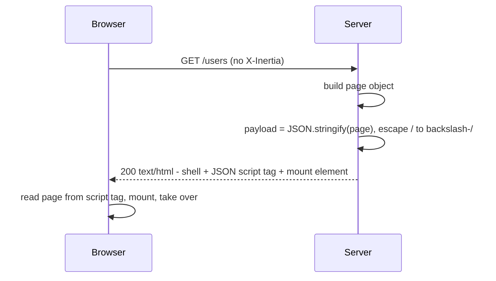
<!-- fig: 02-initial-load | Initial load (HTML shell) -->

### Server-side rendering (optional)

When the server pre-renders, it runs the SSR build with the page object and gets
back `{ head: string[], body: string }`:

- `head` - an array of HTML strings for the document `<head>` (title, meta, etc.).
- `body` - the **payload script plus the pre-rendered mount element**, of the
  form `<script type="application/json" data-page="app">...</script><div id="app"
  data-server-rendered="true">...markup...</div>`, escaped `/` -> `\/` exactly as the
  shell. The `data-server-rendered="true"` attribute tells the client to hydrate
  the existing markup rather than render from scratch.

A full SSR document:

```html ssr document
<!DOCTYPE html>
<html>
  <head>
    <meta charset="utf-8" />
    <meta name="viewport" content="width=device-width, initial-scale=1" />
    <!-- head[]: title/meta produced by the SSR build -->
    <title>Users</title>
  </head>
  <body>
    <!-- body: payload script + pre-rendered mount, from the SSR build -->
    <script type="application/json" data-page="app">{...escaped page object...}</script>
    <div id="app" data-server-rendered="true"><!-- server-rendered markup --></div>
  </body>
</html>
```

The page object and the JSON visit contract are unchanged - SSR only changes how
the **initial HTML** is produced. The client boots identically: it reads the same
`<script data-page>` element, then hydrates in place.

---

## 6. Inertia visit (full visit)

**Trigger:** `X-Inertia: true`, no partial headers.

What the server does:

- Runs the handler and builds the page object.
- Resolves all eager props; handles optional / deferred props per sections 10-12.
- Sets `X-Inertia: true` on the response.
- Returns the page object as JSON (no HTML shell).

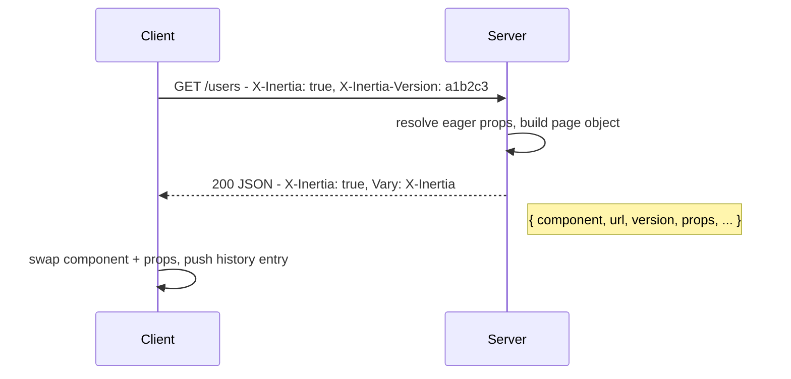
<!-- fig: 06-full-visit | Full visit exchange -->

---

## 7. Asset versioning

`version` is an **opaque** string the server computes from its current frontend
assets (a hash of the build manifest, a deploy id, or a constant). The client
stores the version it last saw and echoes it as `X-Inertia-Version`.

When a **GET** Inertia request carries a version that differs from the server's
current version, the client's cached JS/CSS is stale and cannot safely render new
props. The server MUST force a full browser reload instead of returning JSON:

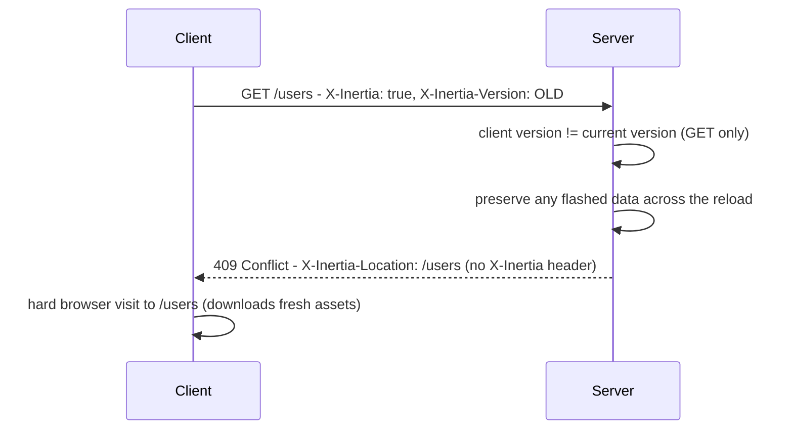
<!-- fig: 04-version-mismatch | Version-mismatch reload -->

Rules:

- The check applies to **GET** requests only.
- An absent `X-Inertia-Version` compares as the empty string.
- The response MUST be `409` with `X-Inertia-Location` set to the requested URL,
  and MUST NOT carry the `X-Inertia` header.
- Any data flashed for the next request (e.g. validation errors, section 17) MUST
  survive the forced reload - the server SHOULD re-flash it.

---

## 8. Redirects

### 8a. Redirect after a mutating request -> 303

- **Why:** a `302` after a `PUT` / `PATCH` / `DELETE` makes the browser re-issue
  the same non-GET method against the redirect target.
- **Rule:** the server MUST convert `302` -> `303` for these methods, forcing the
  browser to follow with a `GET`.

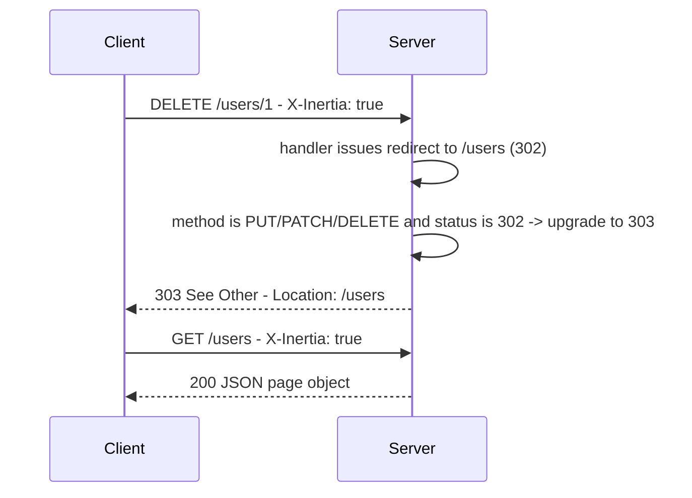
<!-- fig: 05-redirect-303 | 303 redirect after a mutation -->

### 8b. External / forced redirect -> 409 + X-Inertia-Location

- **Use:** send the client to an external site or any non-Inertia page with a
  **hard** browser navigation.
- **Mechanism:** respond `409` with `X-Inertia-Location: <url>` - the same
  mechanism as the version-mismatch reload (section 7).
- A normal `200` / `302` to another Inertia route stays within the SPA; `409` +
  `X-Inertia-Location` is the explicit "leave the SPA" instruction.

---

## 9. Partial reloads (only / except)

**Trigger:** `X-Inertia-Partial-Component` present **and equal to the component
being rendered**. If the names differ, the request MUST be treated as a full
visit (section 6) - the client only requests partials of the page it is currently on.

The client asks for a subset of the current page's props (e.g. to refresh one
table without re-sending everything). The server cherry-picks which props to
resolve and include:

- `X-Inertia-Partial-Data` (`only`) - include only these prop paths.
- `X-Inertia-Partial-Except` (`except`) - include all props except these paths.
- **Always props** are included regardless of the lists (section 11).
- **Optional** and **deferred** props are resolved here - a partial reload is the
  only way the client obtains them (section 12).

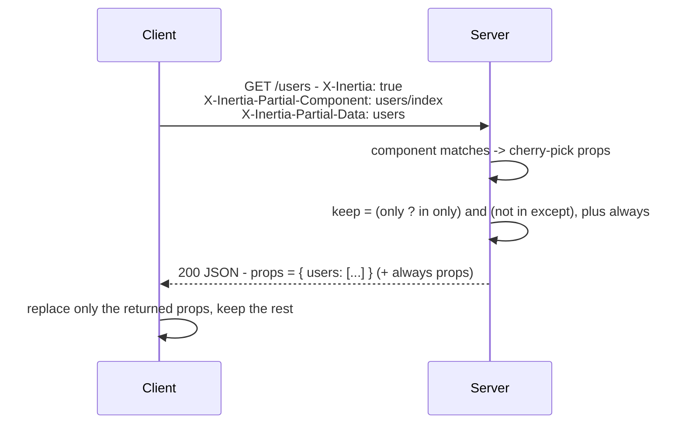
<!-- fig: 09-partial-reload | Partial reload -->

Cherry-pick rule:

```text cherry-pick
keep(path) =
  only  ? ( only.includes(path) && !except.includes(path) )
        : ( !except.includes(path) )
```

`deferredProps` is empty on a partial reload, and `rescuedProps` is only populated
here - see the manifests-by-mode table in section 2.

---

## 10. The prop evaluation model <!-- nav: Prop evaluation model -->

A prop's category determines whether its value is sent and what metadata the
server emits. **The behaviour differs by mode**, so it is given as two tables.

### 10a. On a full visit

| Category | Behaviour | Metadata |
| --- | --- | --- |
| eager | resolved + sent | - |
| always | resolved + sent; cannot be excluded | - |
| optional | **skipped**, not announced | - |
| deferred | skipped, but announced for later fetch | `deferredProps` |
| merge / deepMerge / prepend | resolved + sent + labelled | `mergeProps` / `deepMergeProps` / `prependProps` (+ `matchPropsOn`) |
| once | resolved first time; **skipped** when client holds it | `onceProps` |
| scroll | resolved + labelled + cursor (none of this if deferred) | merge labels + `scrollProps` |

Per-prop decision:

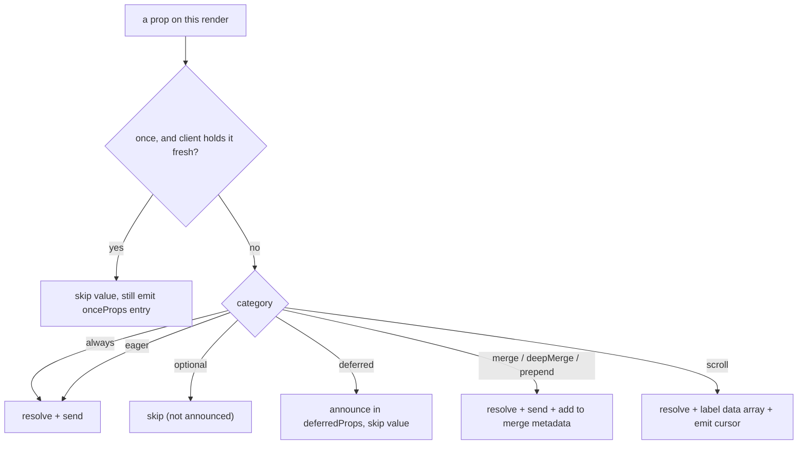
<!-- fig: 10a-fullvisit-prop | Per-prop decision · full visit -->

### 10b. On a partial reload (prop requested via only/except)

| Category | Behaviour | Metadata |
| --- | --- | --- |
| eager | resolved + sent (if requested) | - |
| always | resolved + sent (even if not requested) | - |
| optional | **resolved + sent** | - |
| deferred | **resolved + sent**, or rescued on failure | `rescuedProps` *(only if it failed)* |
| merge / deepMerge / prepend | resolved + sent + labelled | `mergeProps` / `deepMergeProps` / `prependProps` (+ `matchPropsOn`) |
| once | **always resolved + sent** | `onceProps` |
| scroll | resolved + labelled + cursor | merge labels + `scrollProps` |

Per-prop decision (the except-once gate does not apply here):

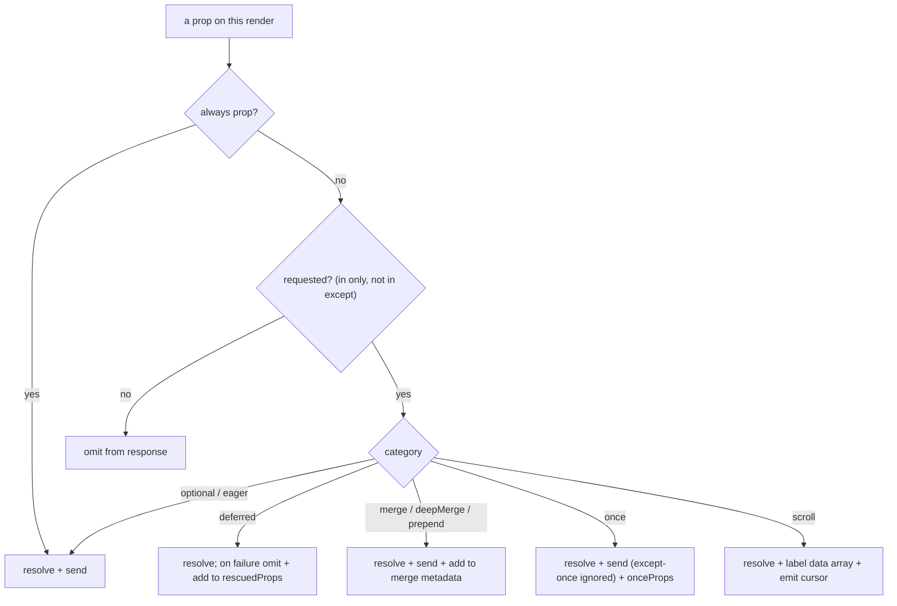
<!-- fig: 10b-partial-prop | Per-prop decision · partial reload -->

> [!NOTE]
> **Categories compose.** A prop can be deferred **and** mergeable, once **and**
> deferred, a scroll prop that is also deferred. The metadata fields are
> independent - a prop may appear in several at once.

---

## 11. Always props

- Included on **every** response, in both modes.
- **Immune to cherry-picking** - on a partial reload it is sent even when its
  path is not in `only` (and even when listed in `except`).
- Use it for data the component cannot render without (current user, CSRF token,
  flash).
- There is no page-object field for "always" - it is purely a server-side
  resolution rule.

---

## 12. Deferred and optional props <!-- nav: Deferred & optional props -->

Both are lazy: not sent on a full visit. They differ in whether the client is
**told the prop exists**.

- **Optional** - never sent on a full visit and **not announced**. The client
  obtains it only by explicitly requesting it in a partial reload (section 9). Use for
  data needed rarely and on demand.
- **Deferred** - never sent on a full visit but **announced** in `deferredProps`,
  grouped by a group name (default `"default"`). After mount, the client
  automatically fires one partial reload per group, requesting that group's prop
  paths.

Deferred props are a **two-phase** exchange - phase 1 ships the manifest, phase 2
fulfills it:

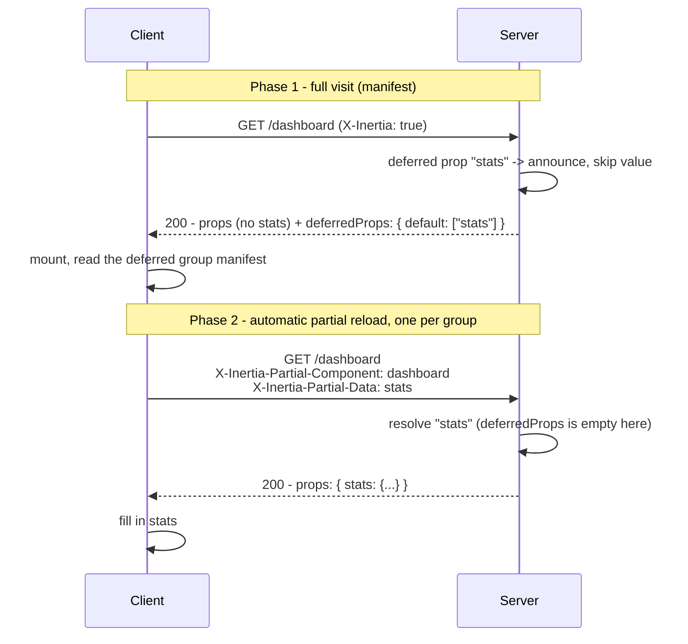
<!-- fig: 12-deferred | Deferred props · two-phase exchange -->

`deferredProps` groups multiple props so they are fetched together in one
follow-up request per group. It is the manifest, so it appears **only on the full
visit** (section 2).

---

## 13. Rescued deferred props

A deferred prop is resolved during its phase-2 partial reload (section 12). If that
resolution **fails**, the naive outcome is that the whole partial response errors
and the client's deferred placeholder is stuck loading forever.

A **rescued** deferred prop fails gracefully. When resolution fails the server
MUST:

1. **Omit** the prop from `props` entirely (do **not** send `null`).
2. Add the prop path to the top-level `rescuedProps` array.
3. Handle/report the error out of band (it MUST NOT propagate into the response).

The client renders the prop's *error* state (its rescue UI) for any path listed
in `rescuedProps`, instead of the loading state.

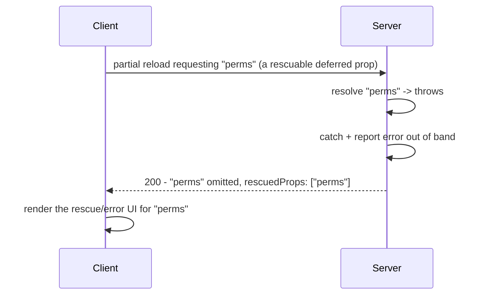
<!-- fig: 13-rescued | Rescued deferred prop -->

The server is stateless about rescue: it reports only the paths rescued on **this**
response. The client reconciles - a path that resolves successfully on a later
request drops out of the rescued set; a repeated failure keeps it. `rescuedProps`
is only consumed for deferred props, and is only ever populated on a partial
reload (section 2).

---

## 14. Merges - directional and keyed

By default a visit **replaces** each prop on the client. A mergeable prop instead
instructs the client to **combine** the incoming value with the value it already
holds - for "load more" lists, live-appended feeds, partial object updates.

**The server only labels; the client performs the merge.** For each mergeable
prop the server sends the (new) value at its path and records the prop path in
exactly one direction array, plus optional keyed-match metadata:

| Label field | Client behaviour |
| --- | --- |
| `mergeProps: ["<path>"]` | append incoming array onto the cached array |
| `prependProps: ["<path>"]` | prepend incoming array before the cached array |
| `deepMergeProps: ["<path>"]` | recursively merge objects/arrays (no direction) |
| `matchPropsOn: ["<path>.<key>"]` | dedupe/replace array items by `<key>` instead of concatenating |

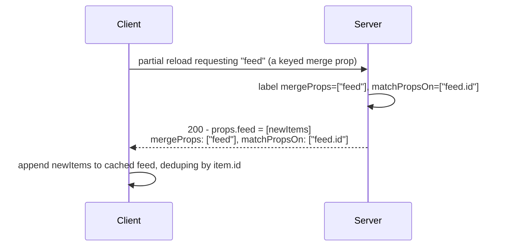
<!-- fig: 14a-keyed-merge | Keyed merge -->

**Keyed-match path format.** Each `matchPropsOn` entry is `"<propPath>.<keyField>"`.
The client splits the entry on its **last** dot: everything before is the prop
path, the final segment is the key field. So `"feed.id"` merges the `feed` array
keyed on `id`; `"feed.data.id"` keys the array at `feed.data`. Direction is
ignored for deep merges (`deepMergeProps` has no `prepend` variant).

### Reset

`X-Inertia-Reset` lists prop paths whose **cached value the client should discard
before merging** (e.g. a filter changed, so "load more" must start from scratch).
For each path in this header, the server MUST send the prop's value **unlabeled**
- present in `props` but in **none** of the merge metadata arrays - so the client
replaces it instead of merging into stale data.

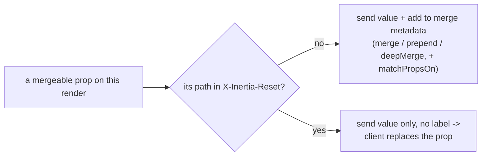
<!-- fig: 14b-merge-reset | Merge reset -->

> [!NOTE]
> The client sends reset prop paths in **both** `X-Inertia-Reset` *and* the `only`
> list, so a reset prop is always re-resolved and returned (it cannot be dropped
> from the response just because it is being reset).

---

## 15. Once props (client-cached props)

A once prop is computed once, **cached by the client across visits**, and
**skipped** by the server on later visits where the client reports it still holds
a fresh value. Use it for expensive, rarely-changing data (lookup tables, enums).

**The client's role**

- After receiving a once prop, the client caches it and reuses it across visits.
- On each request it lists the once-keys it still holds (present + unexpired) in
  `X-Inertia-Except-Once-Props` - meaning "I already have these, don't resend them."

**On a full visit** (server resolves every prop by default)

- Once-key in `X-Inertia-Except-Once-Props` -> **skip the value** (client has it).
- Once-key not in the header -> resolve and send.
- Skip rule: `skip_value = exceptOnceProps.includes(onceKey) && !forceFresh`

**On a partial reload** (server resolves only what is requested)

- The header is **ignored**.
- Once prop explicitly requested -> always resolved and sent.
- Once prop not requested -> omitted (ordinary cherry-picking, section 9).

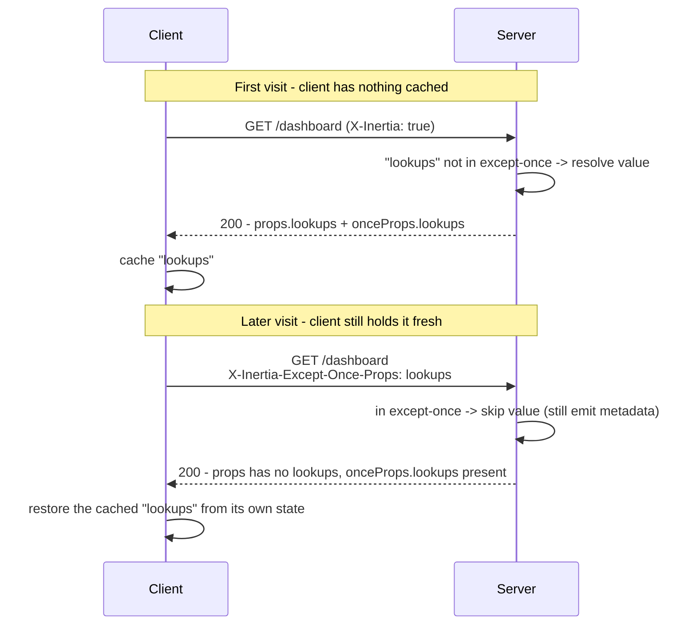
<!-- fig: 15-once | Once props -->

**`onceProps` metadata** - emitted for any once prop in the response, in **both**
modes, so the client can keep using its cached copy. Keyed by once-key:

```jsonc onceProps
"onceProps": {
  "lookups": {
    "prop": "lookups",         // the prop path this caches
    "expiresAt": 1718700000000 // absolute expiry (epoch-ms), or null for no expiry
  }
}
```

- The once-key defaults to the prop path but MAY be a custom string, so one cached
  value can back a prop that appears under different paths across pages.
- `expiresAt` is server-decided. The client tracks freshness against it; the
  server trusts the client's report and does not re-check expiry when deciding to
  skip.

**Force-fresh** (server override)

- Skipping is an optimization, not a requirement.
- The server MAY send a fresh value even when the client lists the key in
  `X-Inertia-Except-Once-Props` - e.g. the cached data changed.
- The sent value and its new `expiresAt` replace the client's cached copy.

---

## 16. Infinite scroll

Infinite scroll layers continuous pagination on the merge primitive (section 14). A
scroll prop is a paginated value - an object with a `data` array plus display
metadata - that the client keeps extending as the user scrolls.

For a scroll prop the server does three things:

1. Resolve the current page's value (`{ data: [...], ...meta }`).
2. **Label the inner `data` array** for merging: the array lives at `<path>.data`,
   so the server emits `"<path>.data"` into `mergeProps` (or `prependProps`), and
   `"<path>.data.<key>"` into `matchPropsOn` if keyed. Labelling the **array
   path** (not the object) is required - the client merges arrays directionally,
   but would shallow-overwrite a bare object and clobber `data`.
3. Emit a **pagination cursor** under `scrollProps[<path>]` telling the client
   which page to request next.

### Cursor - `scrollProps` entry

```jsonc scrollProps
"scrollProps": {
  "users": {
    "pageName": "page",      // query-string parameter the client increments
    "currentPage": 2,        // identifier of the page in this response
    "nextPage": 3,           // identifier of the next page, or null at the end
    "previousPage": 1,       // identifier of the previous page, or null at the start
    "reset": false           // true => client discards cached items first (from X-Inertia-Reset)
  }
}
```

Page identifiers MAY be numbers or opaque strings (offset pages or cursors),
derived from the server's own data source.

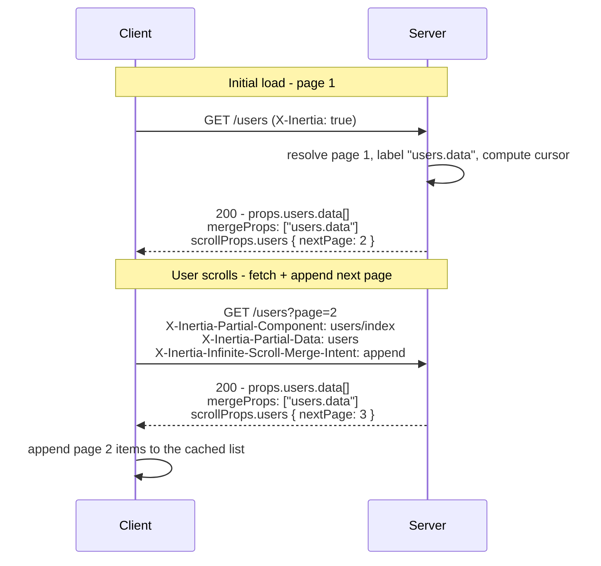
<!-- fig: 16a-infinite-scroll | Infinite scroll -->

> [!NOTE]
> Every response that resolves the scroll prop re-emits its merge label
> (`mergeProps`/`prependProps`, + `matchPropsOn` if keyed) and a fresh
> `scrollProps` cursor - not just the first page.

Rules:

- **Direction** comes from `X-Inertia-Infinite-Scroll-Merge-Intent`: `prepend` ->
  use `prependProps`; anything else (or absent) -> `mergeProps` (append).
- **Keyed dedup** via `matchPropsOn` is opt-in and has no default; without it,
  overlapping pages are plain-concatenated.
- A scroll prop MAY also be **deferred**: on the full visit the server announces
  it in `deferredProps` and emits the merge labels, but emits **no** `scrollProps`
  entry - the cursor is sent only when the value is resolved on the partial reload.

### Reset

As with merges (section 14), a scroll prop whose path is in `X-Inertia-Reset` is sent
unlabeled so the client replaces it - and the server additionally sets
`scrollProps[<path>].reset = true` so the client discards its cached items:

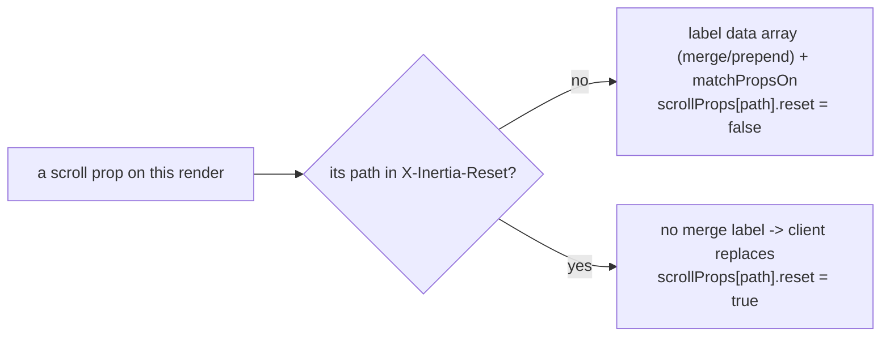
<!-- fig: 16b-scroll-reset | Scroll reset -->

---

## 17. Validation errors

There is no dedicated wire field for validation errors - by convention they
travel as an `errors` prop. The typical flow:

1. A form submission fails validation. The server stores the errors for the next
   request and redirects back (section 8a makes this a `303` for mutating methods).
2. On the next render the server exposes the stored errors as the `errors` prop
   (usually an **always** prop, section 11), shaped `{ field: message }`.
3. If the request carried `X-Inertia-Error-Bag: <name>`, the errors MUST be
   namespaced under that bag - `{ <name>: { field: message } }` - so multiple
   independent forms on one page keep separate error sets.

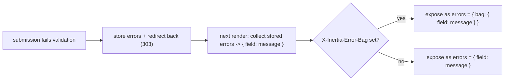
<!-- fig: 17-validation-errors | Validation errors -->

Because errors are stored for the *next* request, they MUST survive both the
`303` redirect (section 8a) and any version-mismatch reload (section 7).

---

## 18. History control

Two boolean flags on the page object control client history behaviour:

- `clearHistory: true` - the client wipes its history stack on this navigation
  (e.g. after logout, so back-navigation cannot reveal authenticated pages).
- `encryptHistory: true` - the client encrypts the history state it persists.

Both default to `false`; a server SHOULD omit them unless enabling them.

---

## 19. Server implementation checklist <!-- nav: Server checklist -->

A conforming server adapter:

- [ ] Detects Inertia visits via `X-Inertia: true`; serves the HTML shell
      otherwise (section 1, section 5).
- [ ] Builds a page object with `component`, `url`, `version`, `props` on every
      render (section 3).
- [ ] Embeds the page object in a `<script type="application/json" data-page>`
      element and escapes `/` -> `\/`; for SSR, emits `head[]` into `<head>` and a
      `data-server-rendered` mount (section 5).
- [ ] Sets `X-Inertia: true` (and SHOULD set `Vary: X-Inertia`) on JSON
      responses (section 4, section 6).
- [ ] Forces a full reload (`409` + `X-Inertia-Location`) on a GET version
      mismatch, preserving flashed data (section 7).
- [ ] Converts `302` -> `303` for `PUT`/`PATCH`/`DELETE` redirects (section 8a).
- [ ] Supports `409` + `X-Inertia-Location` for forced/external redirects (section 8b).
- [ ] Honours partial reloads scoped by `X-Inertia-Partial-Component`, with
      `only`/`except` cherry-picking and always-props (section 9, section 11).
- [ ] Emits the manifests in the correct mode: `deferredProps` on full visits
      only, `rescuedProps` on partial reloads only; merge/scroll/once metadata
      per-response (section 2, section 10).
- [ ] Implements the prop categories: deferred (`deferredProps`), optional,
      rescued (`rescuedProps`), the merge family
      (`mergeProps`/`deepMergeProps`/`prependProps`/`matchPropsOn`) honouring
      `X-Inertia-Reset`, once (`onceProps` + `X-Inertia-Except-Once-Props`), scroll
      (`scrollProps` + merge-intent header) (sections 10-16).
- [ ] Exposes validation errors as `errors`, namespaced by `X-Inertia-Error-Bag`
      when present (section 17).
- [ ] Emits `clearHistory` / `encryptHistory` only when enabled (section 18).
